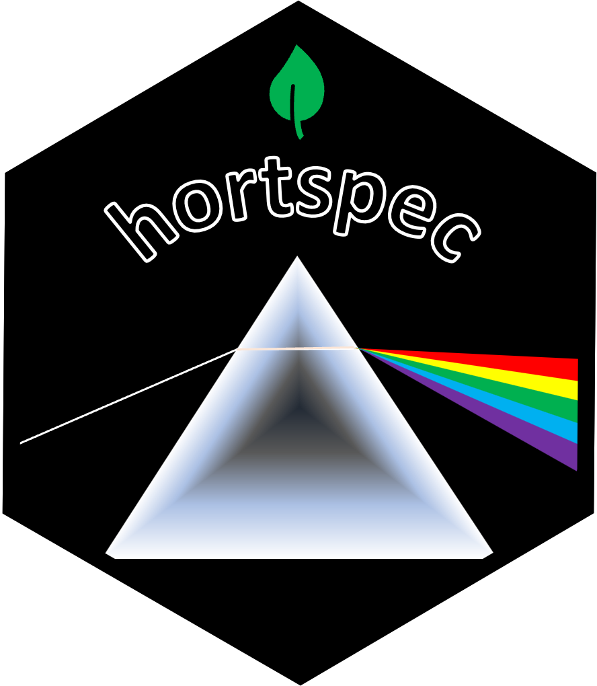
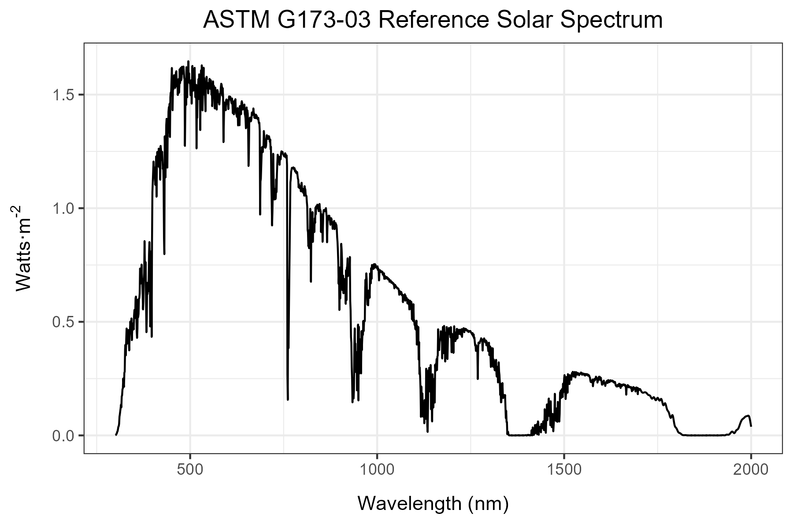

<!-- README.md is generated from README.Rmd. Please edit that file -->

```{r, include = FALSE}
knitr::opts_chunk$set(
  collapse = TRUE,
  comment = "#>",
  fig.path = "man/figures/README-",
  out.width = "100%"
)
```

# hortspec

<!-- badges: start -->
 
<!-- badges: end -->


The goal of the hortspec is to allow for fast and easy conversions between $Watts·m^{-1}$ and $µmol·m^{-2}·m^{-1}$ and for modular calculations of color fractions for horticultural lighting
applications.

### Installation

You can install the development version of hortspec like so:

```{r}
# library(devtools)
# devtools::install_github("nietersc/hortspec")
```

### Color fraction calculation

The `calc_color_fractions` function returns a list containing a `color_fractions` summary table
as well as a `parsed_dataframe` with the color fraction classifications and trapezoidal estimate integration (`trapz_est`) for each wavelength. Colors can be excluded from the color fraction by entering them in the `exclude_colors` argument.

Color names and nanometer ranges:

* uv-c (100-280 nm)
* uv-b (280-315 nm)
* uv-a (315-400 nm)
* blue (400-500 nm)
* green (500-600 nm)
* red (600-700 nm)
* fr-a (far red a, 700-750 nm)
* fr-b (far red b, 750-800 nm)
* nir (near infrared, 800-2500 nm)

An example summary with the attached ASTM solar spectrum:
```{r solar example, message=FALSE}
library(hortspec)

solar_example <- astm_solar_data |>
  calc_color_fractions(value_col = w_m2, wavelength_col = wavelength,
                       exclude_colors = "uv-c")

solar_example$color_fractions

```


### Conversion of measurement readings:
Conversion from $Watts·m^{-1}$ to $µmol·m^{-2}·m^{-1}$

Example conversion of data before calculating color fractions using the attached LED spectrum data:
```{r led 2}
library(hortspec)

umol_converted_spectrum <- led_spectrum_data |>
  watts_to_umol(value_col = w_m2, wavelength_col = wavelength)


led_example <- umol_converted_spectrum |>
  calc_color_fractions(value_col = umol_m2_s, wavelength_col = wavelength,
                       exclude_colors = c("uv-c","uv-b"))

led_example$color_fractions

```


Attached data sets include:




