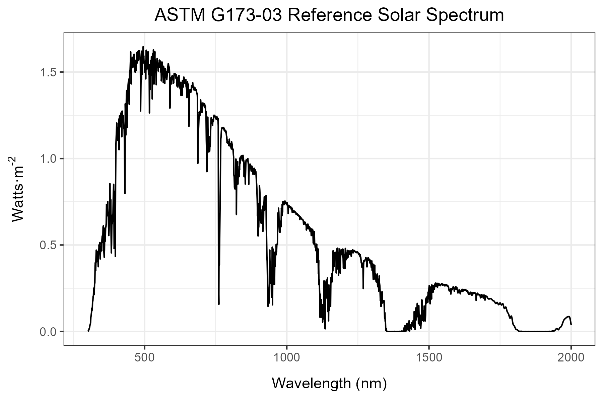
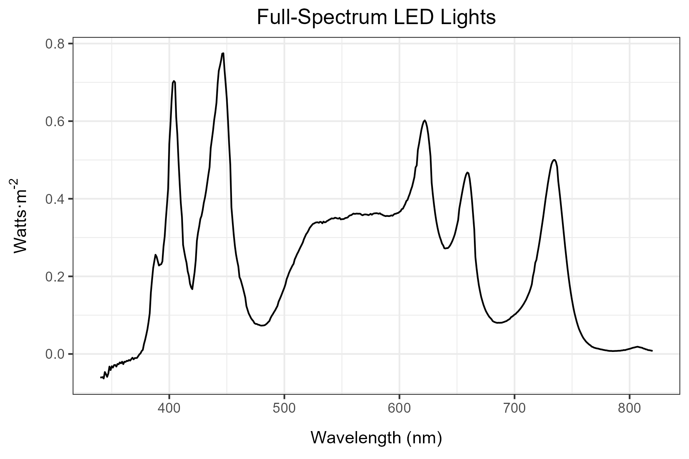

<!-- README.md is generated from README.Rmd. Please edit that file -->

The goal of the hortspec is to allow for fast and easy conversions
between $Watts·m^{-1}$ and $µmol·m^{-2}·m^{-1}$ and for modular
calculations of color fractions for horticultural lighting applications.

### Installation

You can install the development version of hortspec like so:

``` r
# library(devtools)
# install("hortspec")
# library(hortspec)
```

#### Example color fraction calculation

The `calc_color_fractions` function returns a list containing a
`color_fractions` summary table as well as a `parsed_dataframe` with the
color fraction classifications and trapezoidal estimate integration
(`trapz_est`) for each wavelength.

An example summary with the attached ASTM solar spectrum:

``` r
library(hortspec)

solar_example <- astm_solar_data |>
  hortspec::calc_color_fractions(value_col = w_m2, wavelength_col = wavelength,
                       exclude_colors = "uv-c")

solar_example$color_fractions
#> # A tibble: 8 × 2
#>   color percent_of_total
#>   <fct>            <dbl>
#> 1 uv-b               0.1
#> 2 uv-a               4.6
#> 3 blue              14.4
#> 4 green             15.7
#> 5 red               14.5
#> 6 fr-a               6.2
#> 7 fr-b               5.5
#> 8 nir               38.9
```

Conversion from $Watts·m^{-1}$ to $µmol·m^{-2}·m^{-1}$

#### This example shows the conversion of data before calculating color fractions using the attached LED spectrum data:

``` r
library(hortspec)

umol_converted_spectrum <- hortspec::led_spectrum_data |>
  watts_to_umol(value_col = w_m2, wavelength_col = wavelength)


led_example <- umol_converted_spectrum |>
  calc_color_fractions(value_col = umol_m2_s, wavelength_col = wavelength,
                       exclude_colors = c("uv-c","uv-b"))

led_example$color_fractions
#> # A tibble: 7 × 2
#>   color percent_of_total
#>   <fct>            <dbl>
#> 1 uv-a               2.6
#> 2 blue              21.6
#> 3 green             28  
#> 4 red               30.1
#> 5 fr-a              15.6
#> 6 fr-b               1.7
#> 7 nir                0.4
```

Attached data sets include:




